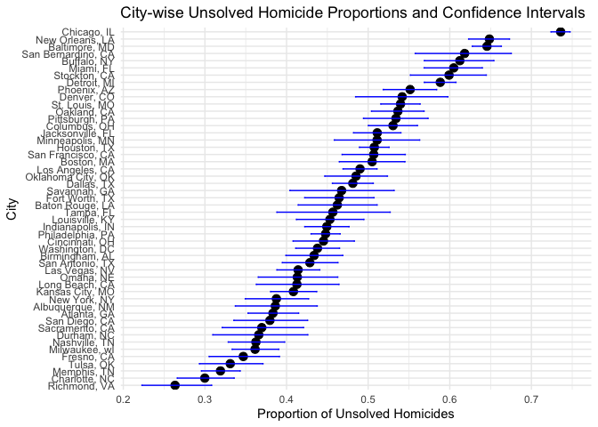
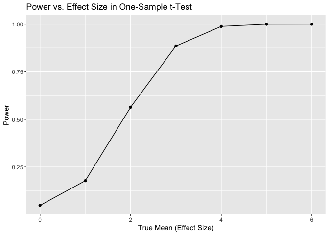
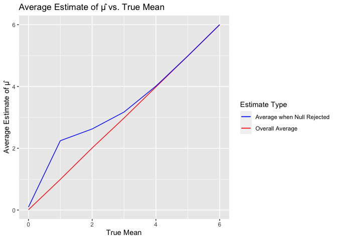

HW5 document
================

``` r
library (tidyverse)
```

    ## ── Attaching core tidyverse packages ──────────────────────── tidyverse 2.0.0 ──
    ## ✔ dplyr     1.1.3     ✔ readr     2.1.4
    ## ✔ forcats   1.0.0     ✔ stringr   1.5.0
    ## ✔ ggplot2   3.4.3     ✔ tibble    3.2.1
    ## ✔ lubridate 1.9.2     ✔ tidyr     1.3.0
    ## ✔ purrr     1.0.2     
    ## ── Conflicts ────────────────────────────────────────── tidyverse_conflicts() ──
    ## ✖ dplyr::filter() masks stats::filter()
    ## ✖ dplyr::lag()    masks stats::lag()
    ## ℹ Use the conflicted package (<http://conflicted.r-lib.org/>) to force all conflicts to become errors

``` r
library(readr)
library(rvest)
```

    ## 
    ## Attaching package: 'rvest'
    ## 
    ## The following object is masked from 'package:readr':
    ## 
    ##     guess_encoding

``` r
library(ggplot2)
```

\#problem1

``` r
data_url = "https://raw.githubusercontent.com/washingtonpost/data-homicides/master/homicide-data.csv"
homicide_data = read.csv(data_url)

formatted_data =
  homicide_data |>
  mutate(combined_city_state = paste(city, state, sep = ", ")) |> 
  group_by(combined_city_state) |> 
  summarise(
    total_cases = n(), 
    unresolved_cases = sum(disposition %in% c("Closed without arrest", "Open/No arrest"))  
  )

formatted_data = formatted_data[formatted_data$combined_city_state != "Tulsa, AL", ] 
formatted_data
```

    ## # A tibble: 50 × 3
    ##    combined_city_state total_cases unresolved_cases
    ##    <chr>                     <int>            <int>
    ##  1 Albuquerque, NM             378              146
    ##  2 Atlanta, GA                 973              373
    ##  3 Baltimore, MD              2827             1825
    ##  4 Baton Rouge, LA             424              196
    ##  5 Birmingham, AL              800              347
    ##  6 Boston, MA                  614              310
    ##  7 Buffalo, NY                 521              319
    ##  8 Charlotte, NC               687              206
    ##  9 Chicago, IL                5535             4073
    ## 10 Cincinnati, OH              694              309
    ## # ℹ 40 more rows

Baltimore analysis

``` r
baltimore_data = homicide_data |> 
  mutate(combined_city_state = paste(city, state, sep = ", ")) |> 
  mutate(case_status = ifelse(disposition == "Closed by arrest", "resolved_cases", "unresolved_cases")) |> 
  filter(combined_city_state == "Baltimore, MD")

baltimore_analysis = prop.test(x = sum(baltimore_data$case_status %in% c("unresolved_cases")), n = nrow(baltimore_data), correct = FALSE)

baltimore_analysis_refined = broom::tidy(baltimore_analysis) |> 
  mutate(conf_interval = paste(conf.low, conf.high, sep = ", ")) |> 
  rename(proportion_estimate = estimate) |> 
  select(proportion_estimate, conf_interval)

baltimore_analysis_refined
```

    ## # A tibble: 1 × 2
    ##   proportion_estimate conf_interval                       
    ##                 <dbl> <chr>                               
    ## 1               0.646 0.627741062080148, 0.662985215590964

City wide analysis

``` r
analysis_df = formatted_data |> 
  mutate(
    test_result_per_city = map2(unresolved_cases, total_cases, ~prop.test(x = .x, n = .y)),
    tidy_result_per_city = map(test_result_per_city, broom::tidy)
  ) |> 
  select(combined_city_state, tidy_result_per_city) |> 
  unnest(tidy_result_per_city) |> 
  select(combined_city_state, estimate, conf.low, conf.high) 

tidy_city_df = analysis_df |> 
  mutate(ci_range = paste(conf.low, conf.high, sep = ", ")) |> 
  rename(proportion_unresolved = estimate) |> 
  select(combined_city_state, proportion_unresolved, ci_range)

tidy_city_df
```

    ## # A tibble: 50 × 3
    ##    combined_city_state proportion_unresolved ci_range                           
    ##    <chr>                               <dbl> <chr>                              
    ##  1 Albuquerque, NM                     0.386 0.337260384254284, 0.4375766065555…
    ##  2 Atlanta, GA                         0.383 0.352811897036302, 0.4148218839536…
    ##  3 Baltimore, MD                       0.646 0.627562457662644, 0.6631598604016…
    ##  4 Baton Rouge, LA                     0.462 0.414198741860307, 0.5110239600187…
    ##  5 Birmingham, AL                      0.434 0.399188948632167, 0.4689557481890…
    ##  6 Boston, MA                          0.505 0.464621930200304, 0.5450880517726…
    ##  7 Buffalo, NY                         0.612 0.568798964634228, 0.6540879392535…
    ##  8 Charlotte, NC                       0.300 0.26608198188312, 0.335899860867845
    ##  9 Chicago, IL                         0.736 0.723995888425454, 0.7473997873066…
    ## 10 Cincinnati, OH                      0.445 0.407960574220688, 0.4831438806189…
    ## # ℹ 40 more rows

Visualization

``` r
ggplot(analysis_df, aes(x = reorder(combined_city_state, estimate), y = estimate)) +
  geom_point(size = 3) +
  geom_errorbar(aes(ymin = conf.low, ymax = conf.high), width = 0.2, color = "blue") +
  coord_flip() +  
  labs(x = "City",
       y = "Proportion of Unsolved Homicides",
       title = "City-wise Unsolved Homicide Proportions and Confidence Intervals") +
  theme_minimal()
```

<!-- -->

\#Problem 2

``` r
file_paths = list.files(path = "data", full.names = TRUE) |> as.list()

file_names <- list.files(path = "data", full.names = FALSE)
combined_data <- file_paths %>%
  map_dfr(read_csv, .id = NULL)
```

    ## Rows: 1 Columns: 8
    ## ── Column specification ────────────────────────────────────────────────────────
    ## Delimiter: ","
    ## dbl (8): week_1, week_2, week_3, week_4, week_5, week_6, week_7, week_8
    ## 
    ## ℹ Use `spec()` to retrieve the full column specification for this data.
    ## ℹ Specify the column types or set `show_col_types = FALSE` to quiet this message.
    ## Rows: 1 Columns: 8
    ## ── Column specification ────────────────────────────────────────────────────────
    ## Delimiter: ","
    ## dbl (8): week_1, week_2, week_3, week_4, week_5, week_6, week_7, week_8
    ## 
    ## ℹ Use `spec()` to retrieve the full column specification for this data.
    ## ℹ Specify the column types or set `show_col_types = FALSE` to quiet this message.
    ## Rows: 1 Columns: 8
    ## ── Column specification ────────────────────────────────────────────────────────
    ## Delimiter: ","
    ## dbl (8): week_1, week_2, week_3, week_4, week_5, week_6, week_7, week_8
    ## 
    ## ℹ Use `spec()` to retrieve the full column specification for this data.
    ## ℹ Specify the column types or set `show_col_types = FALSE` to quiet this message.
    ## Rows: 1 Columns: 8
    ## ── Column specification ────────────────────────────────────────────────────────
    ## Delimiter: ","
    ## dbl (8): week_1, week_2, week_3, week_4, week_5, week_6, week_7, week_8
    ## 
    ## ℹ Use `spec()` to retrieve the full column specification for this data.
    ## ℹ Specify the column types or set `show_col_types = FALSE` to quiet this message.
    ## Rows: 1 Columns: 8
    ## ── Column specification ────────────────────────────────────────────────────────
    ## Delimiter: ","
    ## dbl (8): week_1, week_2, week_3, week_4, week_5, week_6, week_7, week_8
    ## 
    ## ℹ Use `spec()` to retrieve the full column specification for this data.
    ## ℹ Specify the column types or set `show_col_types = FALSE` to quiet this message.
    ## Rows: 1 Columns: 8
    ## ── Column specification ────────────────────────────────────────────────────────
    ## Delimiter: ","
    ## dbl (8): week_1, week_2, week_3, week_4, week_5, week_6, week_7, week_8
    ## 
    ## ℹ Use `spec()` to retrieve the full column specification for this data.
    ## ℹ Specify the column types or set `show_col_types = FALSE` to quiet this message.
    ## Rows: 1 Columns: 8
    ## ── Column specification ────────────────────────────────────────────────────────
    ## Delimiter: ","
    ## dbl (8): week_1, week_2, week_3, week_4, week_5, week_6, week_7, week_8
    ## 
    ## ℹ Use `spec()` to retrieve the full column specification for this data.
    ## ℹ Specify the column types or set `show_col_types = FALSE` to quiet this message.
    ## Rows: 1 Columns: 8
    ## ── Column specification ────────────────────────────────────────────────────────
    ## Delimiter: ","
    ## dbl (8): week_1, week_2, week_3, week_4, week_5, week_6, week_7, week_8
    ## 
    ## ℹ Use `spec()` to retrieve the full column specification for this data.
    ## ℹ Specify the column types or set `show_col_types = FALSE` to quiet this message.
    ## Rows: 1 Columns: 8
    ## ── Column specification ────────────────────────────────────────────────────────
    ## Delimiter: ","
    ## dbl (8): week_1, week_2, week_3, week_4, week_5, week_6, week_7, week_8
    ## 
    ## ℹ Use `spec()` to retrieve the full column specification for this data.
    ## ℹ Specify the column types or set `show_col_types = FALSE` to quiet this message.
    ## Rows: 1 Columns: 8
    ## ── Column specification ────────────────────────────────────────────────────────
    ## Delimiter: ","
    ## dbl (8): week_1, week_2, week_3, week_4, week_5, week_6, week_7, week_8
    ## 
    ## ℹ Use `spec()` to retrieve the full column specification for this data.
    ## ℹ Specify the column types or set `show_col_types = FALSE` to quiet this message.
    ## Rows: 1 Columns: 8
    ## ── Column specification ────────────────────────────────────────────────────────
    ## Delimiter: ","
    ## dbl (8): week_1, week_2, week_3, week_4, week_5, week_6, week_7, week_8
    ## 
    ## ℹ Use `spec()` to retrieve the full column specification for this data.
    ## ℹ Specify the column types or set `show_col_types = FALSE` to quiet this message.
    ## Rows: 1 Columns: 8
    ## ── Column specification ────────────────────────────────────────────────────────
    ## Delimiter: ","
    ## dbl (8): week_1, week_2, week_3, week_4, week_5, week_6, week_7, week_8
    ## 
    ## ℹ Use `spec()` to retrieve the full column specification for this data.
    ## ℹ Specify the column types or set `show_col_types = FALSE` to quiet this message.
    ## Rows: 1 Columns: 8
    ## ── Column specification ────────────────────────────────────────────────────────
    ## Delimiter: ","
    ## dbl (8): week_1, week_2, week_3, week_4, week_5, week_6, week_7, week_8
    ## 
    ## ℹ Use `spec()` to retrieve the full column specification for this data.
    ## ℹ Specify the column types or set `show_col_types = FALSE` to quiet this message.
    ## Rows: 1 Columns: 8
    ## ── Column specification ────────────────────────────────────────────────────────
    ## Delimiter: ","
    ## dbl (8): week_1, week_2, week_3, week_4, week_5, week_6, week_7, week_8
    ## 
    ## ℹ Use `spec()` to retrieve the full column specification for this data.
    ## ℹ Specify the column types or set `show_col_types = FALSE` to quiet this message.
    ## Rows: 1 Columns: 8
    ## ── Column specification ────────────────────────────────────────────────────────
    ## Delimiter: ","
    ## dbl (8): week_1, week_2, week_3, week_4, week_5, week_6, week_7, week_8
    ## 
    ## ℹ Use `spec()` to retrieve the full column specification for this data.
    ## ℹ Specify the column types or set `show_col_types = FALSE` to quiet this message.
    ## Rows: 1 Columns: 8
    ## ── Column specification ────────────────────────────────────────────────────────
    ## Delimiter: ","
    ## dbl (8): week_1, week_2, week_3, week_4, week_5, week_6, week_7, week_8
    ## 
    ## ℹ Use `spec()` to retrieve the full column specification for this data.
    ## ℹ Specify the column types or set `show_col_types = FALSE` to quiet this message.
    ## Rows: 1 Columns: 8
    ## ── Column specification ────────────────────────────────────────────────────────
    ## Delimiter: ","
    ## dbl (8): week_1, week_2, week_3, week_4, week_5, week_6, week_7, week_8
    ## 
    ## ℹ Use `spec()` to retrieve the full column specification for this data.
    ## ℹ Specify the column types or set `show_col_types = FALSE` to quiet this message.
    ## Rows: 1 Columns: 8
    ## ── Column specification ────────────────────────────────────────────────────────
    ## Delimiter: ","
    ## dbl (8): week_1, week_2, week_3, week_4, week_5, week_6, week_7, week_8
    ## 
    ## ℹ Use `spec()` to retrieve the full column specification for this data.
    ## ℹ Specify the column types or set `show_col_types = FALSE` to quiet this message.
    ## Rows: 1 Columns: 8
    ## ── Column specification ────────────────────────────────────────────────────────
    ## Delimiter: ","
    ## dbl (8): week_1, week_2, week_3, week_4, week_5, week_6, week_7, week_8
    ## 
    ## ℹ Use `spec()` to retrieve the full column specification for this data.
    ## ℹ Specify the column types or set `show_col_types = FALSE` to quiet this message.
    ## Rows: 1 Columns: 8
    ## ── Column specification ────────────────────────────────────────────────────────
    ## Delimiter: ","
    ## dbl (8): week_1, week_2, week_3, week_4, week_5, week_6, week_7, week_8
    ## 
    ## ℹ Use `spec()` to retrieve the full column specification for this data.
    ## ℹ Specify the column types or set `show_col_types = FALSE` to quiet this message.

``` r
extracted_details <- tibble(file_name = file_names) %>%
  mutate(
    participant_id = gsub(".*_(\\d+)\\.csv", "\\1", file_name),
    group_type = gsub("^(con|exp)_.*", "\\1", file_name),
  )
```

``` r
final_dataset <- extracted_details %>%
  bind_cols(combined_data) %>%
  select(-file_name) %>%
  pivot_longer(cols = starts_with("week"),
               names_to = "Week",
               values_to = "Observation") %>%
  group_by(participant_id, group_type)

final_dataset
```

    ## # A tibble: 160 × 4
    ## # Groups:   participant_id, group_type [20]
    ##    participant_id group_type Week   Observation
    ##    <chr>          <chr>      <chr>        <dbl>
    ##  1 01             con        week_1        0.2 
    ##  2 01             con        week_2       -1.31
    ##  3 01             con        week_3        0.66
    ##  4 01             con        week_4        1.96
    ##  5 01             con        week_5        0.23
    ##  6 01             con        week_6        1.09
    ##  7 01             con        week_7        0.05
    ##  8 01             con        week_8        1.94
    ##  9 02             con        week_1        1.13
    ## 10 02             con        week_2       -0.88
    ## # ℹ 150 more rows

``` r
spaghetti_plot <- ggplot(final_dataset, aes(x = Week, y = Observation, group = participant_id, color = participant_id)) +
  geom_line(alpha = 0.5) + 
  geom_point(size = 2, alpha = 0.5) + 
  facet_wrap(~group_type) +  
  labs(
    title = "Spaghetti Plot of Observations for Each Subject Over Time",
    subtitle = "Differences Between Experimental and Control Groups",
    x = "Time (Weeks)",
    y = "Observation Value",
    color = "Subject ID"
  ) +
  theme_minimal() +
  theme(legend.position = "none")  

# Display the plot
spaghetti_plot
```

<!-- --> In the `control`group, we
observe that weekly observations have slightly fluctuations within the
range of -1.2 to 3.5. However, in the `experimental`group, An increase
weekly is seen in observations from week 1 to week 8. The differences
between control and experimental groups is that the experimental group
increases as the time increase.

# Problem 3

``` r
library(broom)
library(dplyr)
```

``` r
set.seed(123)
```

``` r
sample_size = 30
standard_deviation = 5
significance_level = 0.05
mean_values_set = 0:6
num_simulations = 5000
```

``` r
simulate_data <- function(n = 30, mu = 0, sd = 5) {
  simulated_values = rnorm(n, mean = mu, sd = sd)
  tibble(values = simulated_values) %>% 
    summarize(estimated_mean = mean(values), estimated_sd = sd(values))
}

simulation_outputs <- map(seq_len(num_simulations), ~ simulate_data(30, 0, 5)) %>% 
                      bind_rows()
```

``` r
t_test_results = data.frame(mean_val = numeric(), mean_estimate = numeric(), p_val = numeric(), is_rejected = logical())

for (mu_val in mean_values_set) {
  estimated_means = numeric(num_simulations)
  p_values = numeric(num_simulations)

  for (j in 1:num_simulations) {
    sample_data = rnorm(sample_size, mean = mu_val, sd = standard_deviation)
    test_result = t.test(sample_data, mu = 0)
    cleaned_result = broom::tidy(test_result)

    estimated_means[j] = cleaned_result$estimate
    p_values[j] = cleaned_result$p.value
  }

  null_rejections = p_values < significance_level
  t_test_results = rbind(t_test_results, data.frame(mean_val = rep(mu_val, num_simulations), mean_estimate = estimated_means, p_val = p_values, is_rejected = null_rejections))
}

head(test_result)
```

    ## $statistic
    ##        t 
    ## 8.805511 
    ## 
    ## $parameter
    ## df 
    ## 29 
    ## 
    ## $p.value
    ## [1] 1.088694e-09
    ## 
    ## $conf.int
    ## [1] 5.406506 8.677833
    ## attr(,"conf.level")
    ## [1] 0.95
    ## 
    ## $estimate
    ## mean of x 
    ##   7.04217 
    ## 
    ## $null.value
    ## mean 
    ##    0

Plotting power vs. Effect size

``` r
power_vs_effect_size = t_test_results %>% 
                       group_by(mean_val) %>% 
                       summarize(power = mean(is_rejected))

ggplot(power_vs_effect_size, aes(x = mean_val, y = power)) +
  geom_line() + geom_point() +
  labs(x = "True Mean (Effect Size)", y = "Power", title = "Power vs. Effect Size in One-Sample t-Test")
```

<!-- --> This plot
illustrates that as the true mean increases, power also increases. In
other words, the power increases with the effect size, where it get
closer to 1.

Plotting average estimate of mu vs. true mu

``` r
average_estimates = t_test_results %>% 
                    group_by(mean_val) %>% 
                    summarize(avg_estimate = mean(mean_estimate),
                              avg_estimate_rejected = mean(mean_estimate[is_rejected]))

ggplot(average_estimates, aes(x = mean_val)) +
  geom_line(aes(y = avg_estimate, color = "Overall Average")) +
  geom_line(aes(y = avg_estimate_rejected, color = "Average when Null Rejected")) +
  labs(x = "True Mean", y = "Average Estimate of μ̂", color = "Estimate Type") +
  ggtitle("Average Estimate of μ̂ vs. True Mean") +
  scale_color_manual(values = c("Overall Average" = "red", "Average when Null Rejected" = "blue"))
```

<!-- -->

The observed sample mean of μ̂ in tests where the null hypothesis is
rejected does not align closely with the true value of μ for lower
values such as 1 and 2, but it tends to be more consistent for higher
values like 3, 4, 5, and 6.

For the lower values (μ = 1, 2), the discrepancy can be attributed to
the small effect size, which hovers near the hypothesized null value. In
such scenarios, the inherent variability in sampling, along with the
potential for sampling errors, can introduce randomness. This randomness
may lead to the observed sample mean of μ̂ deviating from the true mean
when the null hypothesis is rejected.

Conversely, for the higher values (μ = 3, 4, 5, 6), the effect size is
considerably larger, enhancing the ability to detect statistically
significant differences. In these cases, the observed sample mean of μ̂
tends to be a more accurate reflection of the true mean. The larger
discrepancies from the null hypothesis value are more readily detected,
lending to a closer alignment between the observed sample mean and the
true value.
